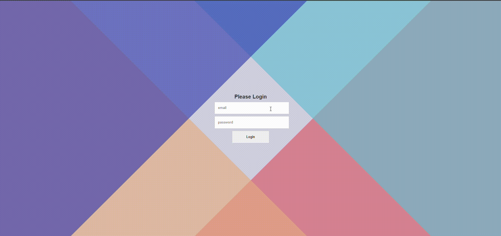

<div align="center">
  
  <h1>👋 Welcome to <span style="color:#7C3AED">Vertex Dashboard</span>!</h1>
  <p><b>Modern, Secure & Lightning Fast Admin Dashboard</b></p>
  
</div>

---

<div align="center">
  
  
  
  
</div>

---

<h3>🔐 Demo Credentials</h3>
<ul>
  <li><b>Email ID:</b> <code>admin@gmail.com</code> <i>(case-sensitive)</i></li>
  <li><b>Password:</b> <code>pass</code> <i>(case-sensitive)</i></li>
</ul>

---

<h2>✨ Features</h2>
<ul>
  <li>📱 <b>Responsive Design</b></li>
  <li>🔐 <b>Protected Routes & Authentication</b></li>
  <li>🎨 <b>Modern UI/UX</b></li>
  <li>📨 <b>Inbox System</b></li>
  <li>⭐ <b>Favorites Management</b></li>
  <li>🚀 <b>Blazing Fast with Vite</b></li>
  <li>🎯 <b>Intuitive Navigation</b></li>
</ul>

---

<h2>📁 Project Structure</h2>

```text
src/
├── components/
│   ├── Home/
│   │   ├── Content/
│   │   ├── css/
│   │   └── Images/
│   └── ProtectLogin.jsx
├── Pages/
│   ├── Homepage.jsx
│   └── Login.jsx
└── assets/
```

---

<h2>🚀 Getting Started</h2>

<ol>
  <li><b>Clone the repository</b></li>
  <li><b>Install dependencies:</b>
    <pre><code>npm install</code></pre>
  </li>
  <li><b>Start the development server:</b>
    <pre><code>npm run dev</code></pre>
  </li>
  <li><b>Open your browser</b> and navigate to the local server address shown in your terminal</li>
</ol>

---

<h2>⚙️ Development Perks</h2>
<ul>
  <li>🔥 Hot Module Replacement (HMR)</li>
  <li>🧹 ESLint Integration</li>
  <li>⚡ Fast refresh</li>
</ul>

---

<h2>📄 License</h2>
<p>This project is licensed under the <b>MIT License</b>.</p>
